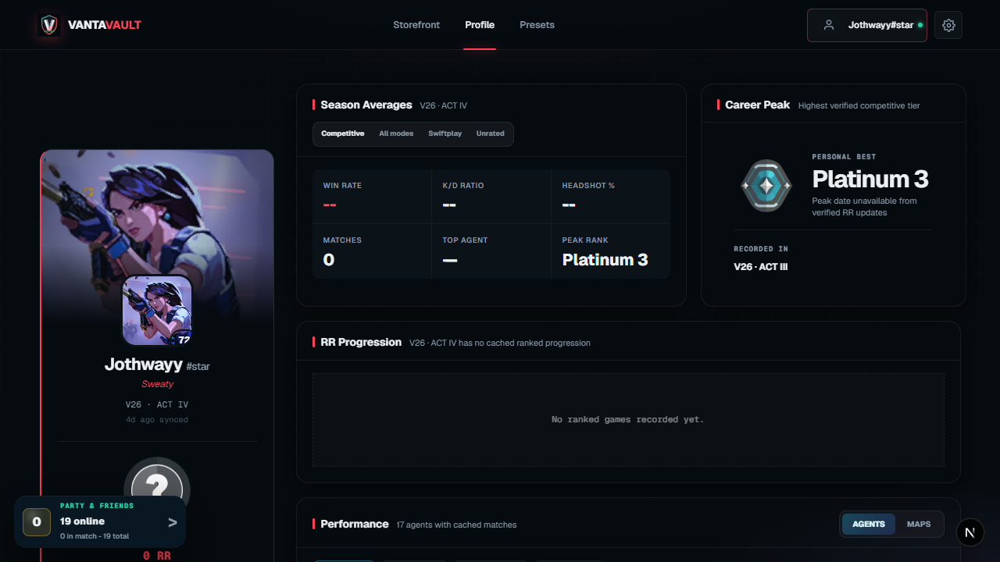
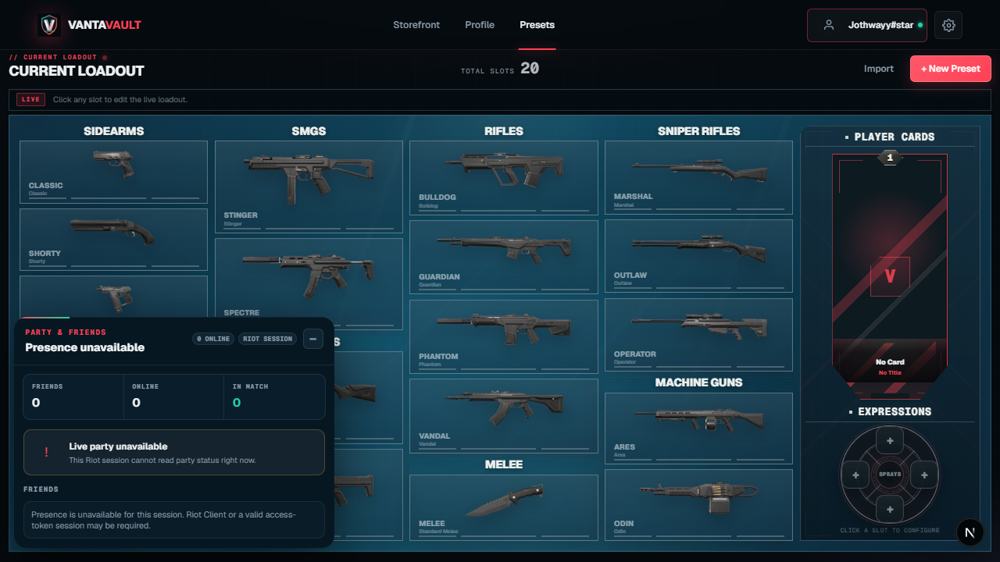
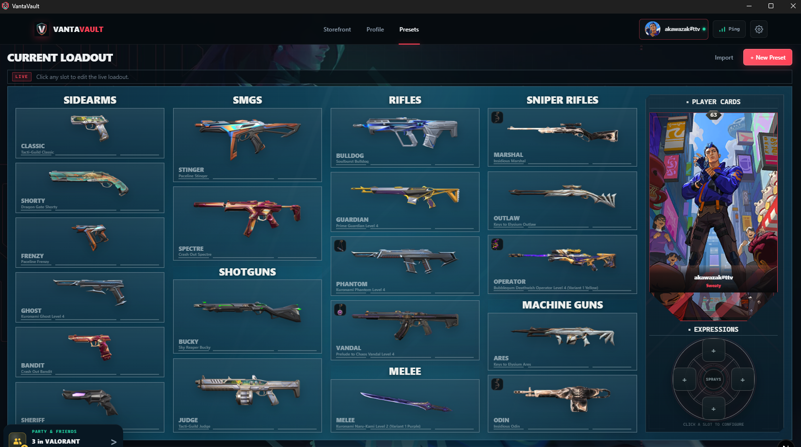
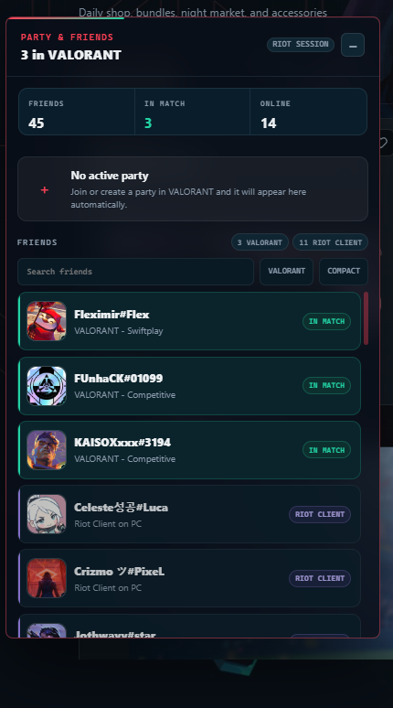
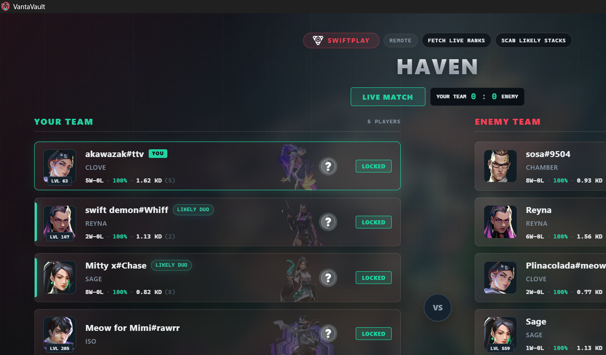
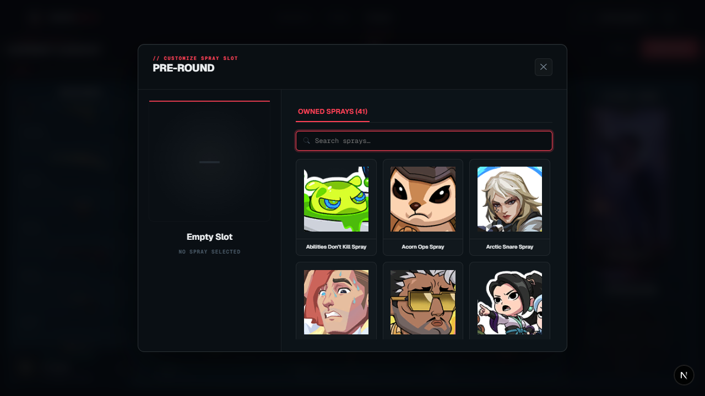
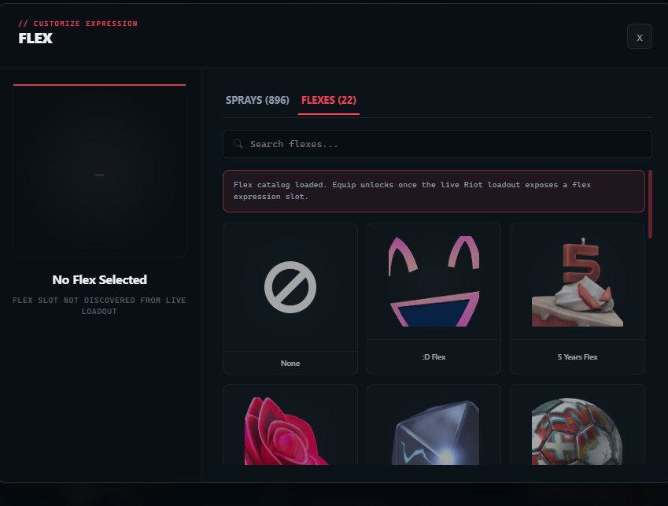

<div align="center">
  
  <h1>VantaVault</h1>
  <p>A private, open-source Windows VALORANT companion app for loadouts, the storefront, profiles, friends, parties, and live-match context.</p>
  <p>
    <a href="https://github.com/akawazak/valo-project/releases/latest"></a>
    <a href="https://github.com/akawazak/valo-project"></a>
    <a href="https://discord.gg/gxGQwWyECE"></a>
    <a href="LICENSE"></a>
    
    
  </p>
  <p>
    <a href="https://vanta-vault-app.vercel.app/"><strong>Website</strong></a> ·
    <a href="https://github.com/akawazak/valo-project/releases/latest"><strong>Download for Windows</strong></a> ·
    <a href="#screenshots">Screenshots</a> ·
    <a href="#features">Features</a> ·
    <a href="#installation">Installation</a> ·
    <a href="https://github.com/akawazak/valo-project/issues">Report an issue</a>
  </p>
</div>

> [!IMPORTANT]
> VantaVault is not endorsed by Riot Games. Riot Games, VALORANT, and related assets are trademarks of Riot Games, Inc.

## About VantaVault

VantaVault is a native Windows companion for VALORANT players who want their loadouts, storefront, profile, match history, social presence, and live-match context in one place instead of scattered across browser tabs and the Riot Client. It is designed as a private desktop app: account data and sessions remain on your computer.

Use it as a VALORANT loadout manager, skin-store companion, match-history viewer, party and friends monitor, and live-match companion. Availability of Riot Client data varies by game phase and by the fields Riot exposes.

## What's new in 0.5.27

- **Activity and sound:** a persistent notification center now surfaces wishlist matches, Riot messages, and app errors, with configurable interface sounds and volume.
- **Desktop polish:** Settings, loading, storefront, party, live-match, and Profile views were redesigned, with keyboard shortcuts and new Viper, Harbor, and Gekko wallpapers.
- **Match intelligence:** richer live loadouts, Discord presence, current-act RR handling, competitive archives, and stored round analytics make Riot data clearer without guessing missing fields.
- **Reliability:** fixed stale previous-act ranks, placement records, queue timers, friend-request cancellation, remote/local account fallback, cross-weapon cosmetic matching, the production image dependency audit, and portable startup on Windows systems without the Visual C++ Redistributable.

## Previous release: 0.5.26

- **Match review:** interactive post-match fight maps now connect duel positions, weapons or abilities, repeat locations, and round impact without requiring recorded video.
- **Progression:** profile tools now include daily checkpoints, missions, contracts, account XP, and Battle Pass progress.
- **Appearance and community:** Settings has clearer sections, local Valorant wallpapers, accent choices, Discord community access, and a readable light palette across the main application shell.
- **Reliability:** current-act RR, hidden-player names, party evidence, mission renewal, signed portable updates, and backend replacement were hardened.
- Release packaging now publishes `VantaVault-portable.exe`, its signature, and a small portable update manifest alongside the normal Windows installer.
- **In-app live match view:** VantaVault can reveal the already-loaded main app during agent select or with **Alt + T**, without launching a second overlay window or intentionally taking focus from VALORANT.
- Alt + T shows the normal VantaVault app window centered at a fixed 1280 × 720 above VALORANT without activating it, then hides the same window when pressed again. Opening VantaVault normally restores its previous size and position. It does not make VantaVault fullscreen or inject code into the game.
- Live-match profile checks reuse already fetched rank and likely-stack data while Riot rate limits cool down, so opening a player profile no longer throws away useful match context.

## What's new in 0.5.21

- **Live Match** now shows the current score when the local Riot presence feed provides it, offers an on-demand **Fetch live ranks** action, and can scan recent matches for clearly labelled likely premades.
- Live rank refreshes are retried in the background when Riot data is temporarily unavailable, while the manual button remains available as a fallback.
- The live overlay recognises Training Range correctly instead of inheriting a stale queue label, and separates queue type, map, score, teams, ranks, peak ranks, and likely-stack evidence.
- **Preset agents** can be assigned from the saved-preset editor. The selector shows every agent, locks agents the account does not own, and supports selecting or removing multiple owned agents.
- Saved presets use their own full loadout editor. Editing a preset never temporarily replaces the Current Loadout behind the dialog, and closing the dialog restores the live loadout before it disappears.
- Current Loadout edits are applied from the individual weapon picker. Leaving a picker without applying no longer leaves a misleading temporary change in the loadout view.
- Party & Friends and the minimized live-match widget stay within the visible app window after resizing, then return to their original docked edge when the window is enlarged again. Reopening Party & Friends returns to the main panel rather than a previously viewed profile.
- Friend and party profiles can be opened from presence cards and reliably return to the correct social panel when closed.

## Screenshots

### Profile and competitive history



### Complete loadout editor



### Current Loadout



### Party and Friends



### Live Match



### Cosmetic picker



### Flex picker



## Features

| Area | What VantaVault provides |
| --- | --- |
| Loadouts | Save, import, export, edit, and apply weapon, buddy, spray, identity, flex, and agent presets. Assign multiple owned agents to a saved preset, use the dedicated preset editor, and apply changes to VALORANT only when ready. Custom match presets restore the previous loadout after the match. |
| Storefront | View the daily store, rotating featured bundles, Night Market, accessories, wallet balances, prices, upgrades, and skin variants. Wishlist skins and receive a notification when they return. |
| Accounts | Manage multiple Riot accounts with persistent WebView2 sessions and sequential access renewal. |
| Profile | Automatically sync your profile, inspect rank and match history, and open friends or party members directly in the profile view. |
| Social | See local and remote friend presence, known party groups, player cards when Riot exposes or cached match data provides them, pregame state, and live-match information when available. The docked Party & Friends panel stays reachable when the app window changes size. |
| Live Match | View agent picks, teams, map, queue type, live score when Riot presence provides it, direct rank refreshes, current and peak ranks where available, confirmed own-party markers, and clearly marked likely stacks from recent-match evidence. Agent select and **Alt + T** can reveal the existing app without starting a second data-loading window. |
| Discord | Show Browsing Store, Building a Loadout, Agent Select, agent, queue, map, and In Match activity through Rich Presence. |
| Privacy | Keep match history locally with configurable retention and sanitized diagnostics export. |

### Remote account and local Riot Client support

| Feature | Remote account | Local Riot Client / lockfile |
| --- | :---: | :---: |
| Storefront, wallet, owned cosmetics and loadout changes | Yes | Yes |
| Profile, match history, map review and progression | Yes | Yes |
| Party state and direct-message presence | Yes | Yes |
| Direct messages | Yes | Yes |
| Party chat and friend-request actions | No | Yes |
| Pregame and live-match teams | Yes, when Riot exposes the active session | Yes |
| Exact live score and automatic local game detection | No | Yes |
| Automatic custom-match preset apply/restore | No | Yes |
| Wishlist checks and Discord Rich Presence | While VantaVault is running | While VantaVault is running |

VantaVault prefers the selected remote account when it has a valid session and falls back to the local Riot Client only when that client is signed into the same account. It never substitutes data from a different local account.

## Installation

1. Open the [latest release](https://github.com/akawazak/valo-project/releases/latest).
2. Download `VantaVault-portable.exe` for the no-setup version, or `VantaVault_*_x64-setup.exe` if you prefer Start Menu integration.
3. Launch VantaVault and connect a Riot account.

Windows may show a SmartScreen warning for community builds that are not code-signed. Review the release source before choosing **Run anyway**.

### Which download should I use?

GitHub releases distribute Windows files; they do not host a web version of VantaVault.

- **`VantaVault-portable.exe`** is the no-setup option. Run the single file from anywhere; Settings downloads, verifies, and switches to future portable releases without opening a setup wizard.
- **`VantaVault_*_x64-setup.exe`** is an optional per-user installer. It includes the VantaVault icon, Start Menu integration, the local backend, and in-app updates.
- GitHub's source-code ZIP files are for developers and are not needed to use the app.

## Requirements and limitations

- Windows 10 or 11 with WebView2. The installer can bootstrap it; portable builds use an existing Windows WebView2 installation.
- Party, loadout, presence, and live-match data depend on a running Riot client, the active Riot session, and the current game phase.
- Riot does not expose every field consistently; VantaVault does not guess private identities or unknown party relationships.
- Live score requires the local Riot client presence feed.
- Flex cosmetics are supported when Riot and the current community metadata catalog expose the item. Newly released artwork can briefly appear as cached or pending while the catalog refreshes in the background.

## Development

### Clone and run from source

#### Windows prerequisites

Install all of the following before launching the app locally:

- [Node.js](https://nodejs.org/) (includes npm)
- [Go 1.25+](https://go.dev/dl/)
- [Rust 1.77.2+](https://www.rust-lang.org/tools/install) using the default MSVC toolchain
- [Visual Studio Build Tools 2022](https://visualstudio.microsoft.com/visual-cpp-build-tools/) with the **Desktop development with C++** workload
  - In the French installer, select **Développement Desktop en C++**
  - Ensure **MSVC v143 - VS 2022 C++ x64/x86 build tools** and a **Windows 10/11 SDK** are selected
- Microsoft Edge WebView2 Runtime (already included with current Windows 10/11 installations)

After installing the Build Tools, close and reopen PowerShell so Rust can find `link.exe`. You can verify the setup with:

```powershell
node --version
npm --version
go version
rustc --version
cargo --version
```

Open PowerShell in the folder where you want the project, then run:

```powershell
git clone https://github.com/akawazak/valo-project.git
cd valo-project\frontend
npm install
npm.cmd run desktop
```

`npm.cmd run desktop` is the only command needed after installation. It starts the interface, builds and starts the private Go backend as a sidecar, and opens the desktop window. Keep that PowerShell window open while using the development app. Press `Ctrl+C` once when you want to stop it.

> [!WARNING]
> Do not run `go run .` separately. The backend requires a private key generated by Tauri for each launch, and the desktop command already starts it on port `31719`. Starting a second backend causes key or port errors.

On later launches, return to the cloned folder and run:

```powershell
cd path\to\valo-project\frontend
npm.cmd run desktop
```

If a previous launch ended with exit code `101`, close any remaining VantaVault window, stop the old PowerShell process with `Ctrl+C`, and run the desktop command again.

To inspect the installed Tauri prerequisites or create the Windows installer:

```powershell
npm.cmd run tauri -- info
npm.cmd run tauri -- build
```

If compilation reports `linker 'link.exe' not found`, install the Visual Studio C++ workload described above, then restart PowerShell.

### Interface-only browser preview

You can preview the Next.js interface in a browser with:

```powershell
cd valo-project\frontend
npm.cmd run dev
```

This is only useful for interface work. Riot accounts, the private backend, Discord Rich Presence, updates, and other Tauri features require `npm.cmd run desktop`.

### Android development target

Android is a second native Tauri target; it does not replace or reduce the Windows app. It has a separate phone-oriented interface under `frontend/src/mobile` while reusing the same data contracts and remote-account backend routes. Android embeds the Go backend as an in-process ARM library; Windows continues to build and launch the Go `.exe` sidecar.

The Android target is installable for device testing and has a production signing path, but it is not yet published on Google Play. Riot sign-in runs in an isolated native Android WebView, and persistent Riot session secrets are encrypted with an app-owned AES-256-GCM key in Android Keystore. The encrypted envelopes are stored under Android's no-backup application directory. Short-lived Riot access is renewed silently from that saved session before expiry and once after startup if the app was closed while it expired; the Accounts sheet exposes Renew/Repair when Riot requires sign-in again. The local chat archive uses a separate random Android key wrapped by the same Keystore-backed key, so saved Riot conversations survive app restarts without storing the archive key in plaintext. Windows-only features such as the Riot lockfile, local game detection, Alt+T overlay, tray, autostart, Discord Rich Presence, and desktop updater are intentionally excluded from Android.

The mobile interface currently includes the daily and featured stores, Night Market, wallet, party, contracts and Battle Pass progress, player identity and sprays, owned weapon/skin/variant/buddy loadouts, full preset editing and application, a unified friends/chat view, conditional live-match data, player and friend profiles, rank progression, profile statistics, and locally cached match history. Daily checkpoints display Riot's real four-charge progress for all four milestones. Night Market opens as a focused bottom sheet instead of expanding the Home feed, while equipped sprays use the same shared four-direction Riot slot model as Windows and VALORANT. Tapping the Home player card or an individual spray wedge deep-links directly into that live-loadout picker. Existing encrypted conversations load their newest page immediately, visibly report Riot-history sync state, and can page backward through older cached messages without sending another Riot archive request or losing scroll position. Recent matches expose queue/act filters and a lazy cached ten-player scoreboard; any non-local scoreboard player can be opened as another profile. The preset screen keeps the equipped loadout as its editable baseline, exposes explicit Edit and Apply actions, and uses compact bottom-sheet pickers for owned cards, owned titles, and individual spray-wheel slots; agent auto-switch assignments reject agents that the current account does not own. Desktop and Android call the same preset payload builder, including variant inheritance for weapons, identity, sprays, flexes, and expressions. It exposes the useful desktop account data in a phone-oriented layout instead of copying the desktop window structure.

Install Android Studio and use SDK Manager to install:

- Android SDK Platform 36
- Android SDK Platform-Tools
- Android SDK Build-Tools 36
- Android SDK Command-line Tools
- A stable Android NDK (Side by side)

Set `JAVA_HOME`, `ANDROID_HOME`, and `NDK_HOME` to the Android Studio JDK, SDK, and installed NDK. Then install the Rust Android targets:

```powershell
rustup target add aarch64-linux-android armv7-linux-androideabi i686-linux-android x86_64-linux-android
```

Connect an Android phone with USB debugging enabled and accepted, then verify it is available:

```powershell
& "$env:ANDROID_HOME\platform-tools\adb.exe" devices
```

Windows Developer Mode is recommended because Tauri creates a JNI symbolic link during Android builds. With Developer Mode enabled, run:

```powershell
cd path\to\valo-project\frontend
npm install
npm run android:dev -- --open
```

Keep the Tauri command running while Android Studio is open. To build an ARM64 debug APK:

```powershell
npm run android:build -- --debug --apk --target aarch64
```

The generated Android Studio project is under `frontend\src-tauri\gen\android`.

Pull requests that touch the frontend or backend run an ARM64 Android build, Gradle unit tests, and Android lint in GitHub Actions. Production keystore and Windows publisher-certificate setup is documented in [Release signing](docs/RELEASE_SIGNING.md); private keys are never stored in the repository.

If Windows Developer Mode is disabled, Tauri can still compile the Rust and Go libraries but stops at the JNI symlink step. For an ARM64 phone, copy the compiled library, let Gradle package it without rebuilding Rust, and install the APK:

```powershell
Copy-Item `
  .\src-tauri\target\aarch64-linux-android\debug\libapp_lib.so `
  .\src-tauri\gen\android\app\src\main\jniLibs\arm64-v8a\libapp_lib.so `
  -Force

cd .\src-tauri\gen\android
.\gradlew.bat :app:assembleArm64Debug -x :app:rustBuildArm64Debug --no-daemon

& "$env:ANDROID_HOME\platform-tools\adb.exe" install -r `
  .\app\build\outputs\apk\arm64\debug\app-arm64-debug.apk
& "$env:ANDROID_HOME\platform-tools\adb.exe" shell monkey `
  -p com.akawazak.valovault -c android.intent.category.LAUNCHER 1
```

This workaround does not require the Windows C++ workload. The C++ workload listed above is still a Windows-from-source requirement for Rust's MSVC linker; it is not an Android app dependency.

### Discord Rich Presence

The official VantaVault Discord Application ID and `logo` asset are already configured. Keep the Discord desktop app running and VantaVault connects automatically, including when Discord starts after VantaVault. Forks can override the ID with `VANTAVAULT_DISCORD_CLIENT_ID` or a `discord_client_id.txt` file in the VantaVault app configuration directory.

### Validation

```powershell
cd backend
go test ./...
go build .

cd ..\frontend
npm run build
npm run lint
cargo test --manifest-path src-tauri\Cargo.toml
```

## Privacy and security

Account sessions are stored locally in WebView2 user-data folders and the app configuration directory. Never share Riot access tokens, entitlement tokens, SSID cookies, account data, or diagnostic logs containing identifiers. Read [Privacy](PRIVACY.md) and [Terms](TERMS.md) before distributing or modifying account-related behavior.

## Contributing and releases

Fork the repository, branch from the latest `main`, keep changes focused, run the validation commands above, and open a pull request with the root cause and verification evidence.

## Credits

- [truearken/valovault](https://github.com/truearken/valovault) — original loadout workflow, local-client integration, and Tauri foundation.
- [victorxia18/valorant-shop-checker](https://github.com/victorxia18/valorant-shop-checker) — inspiration for Riot OAuth and remote storefront retrieval.

Released under the [Apache License 2.0](LICENSE).
